# Справочник техники упражнений 📖

Единый справочник для всех подробных планов сезона 2026-2027. В планах упражнения указываются кратко (название + объём) и ссылаются сюда. **Новое упражнение в плане → сначала карточка здесь.**

Формат карточки: **Зачем** (роль в подготовке) · **ИП** (исходное положение) · **Движение** · **Темп и дыхание** · **Типичные ошибки** · **Легче / тяжелее**. Иллюстрации в `img/` — ориентир по позициям, текст первичен.

---

## Оглавление

| Группа | Упражнения |
|--------|-----------|
| 🔻 Спуски и специфика | [Техника бега на спуске](#downhill) · [Power-hike на дорожке](#power-hike) · [Стеймастер](#stairmaster) · [Спуск по лестнице шагом/бегом](#stairs-down) · [Горные ускорения / страйды](#strides) |
| 🦵 Ноги: эксцентрика и сила | [Темповый присед (гоблет/штанга)](#tempo-squat) · [Фронтальный присед](#front-squat) · [Сплит-присед](#split-squat) · [Выпад назад](#reverse-lunge) · [Step-down с тумбы](#step-down) · [Боковой step-down](#lateral-step-down) · [Step-up с жилетом](#step-up) · [Сисси-присед](#sissy-squat) · [Reverse Nordic](#reverse-nordic) · [Испанский присед](#spanish-squat) · [Изометрия «стульчик»](#wall-sit) · [Одноногий жим ногами с эксцентрикой](#leg-press-ecc) · [Подъём на носки одноногий эксцентрический](#calf-raise) |
| ⚡ Плиометрика | [Drop landing (приземления)](#drop-landing) · [Pogo hops](#pogo) · [Depth jump](#depth-jump) · [Одноногие прыжки вперёд](#single-leg-hop) · [Боковые прыжки на одну ногу](#lateral-hop) |
| 💪 Верх тела | [Подтягивания](#pull-up) · [Тяга в кольцах / TRX](#ring-row) · [Отжимания](#push-up) · [Жим гантелей стоя](#db-press) · [Жим гантели одной рукой стоя](#db-press-single) · [Жим гантелей лёжа](#db-bench) · [Тяга верхнего блока](#lat-pulldown) |
| 🧘 Кор | [Dead bug](#dead-bug) · [Планка на локтях](#plank) · [Боковая планка](#side-plank) · [Bird dog](#bird-dog) · [Hollow hold](#hollow) · [Superman](#superman) · [Pallof press](#pallof) |
| 🦶 Баланс и стопа | [Стойка на одной ноге (глаза закрыты)](#single-leg-stance) · [Стойка на BOSU + «часы»](#bosu-clock) · [«Часы» стопой на полу](#clock) · [Ходьба по линии](#line-walk) · [Боковые шаги с резиной](#band-steps) · [Полотенце пальцами стопы](#towel) |
| 🚣 Кардиотренажёры (палки) | [Гребной тренажёр](#rowing) · [Ски-эрг](#ski-erg) |
| 🔄 Мобилити и восстановление | [Кошка-корова](#cat-cow) · [90/90 бёдра](#90-90) · [Выпад назад с рукой вверх (сгибатели бедра)](#hip-flexor) · [Голеностоп у стены](#ankle-wall) · [Ролл квадрицепсов и ИТ-тракта](#foam-roll) |

---

## 🔻 Спуски и специфика

### Техника бега на спуске
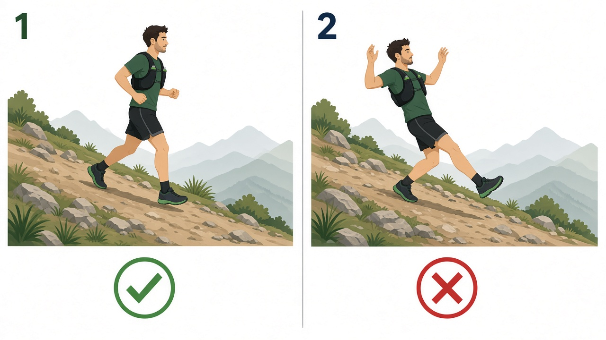
- **Зачем:** главный лимитер сезона. Правильная техника снижает эксцентрическую нагрузку на квадрицепсы на 20–30% и риск падения.
- **ИП:** корпус **перпендикулярно склону** (кажется, что «падаешь вперёд»), взгляд на 3–5 м вперёд по тропе, руки широко и свободно.
- **Движение:** короткий частый шаг (каденс 180+), стопа приземляется на середину **под таз**, колено мягкое. Скорость регулируется частотой шагов, не длиной. На крутом (>25%) — зигзаг, боком, короткие «приставные» шаги; палки — короткие тычки сбоку, не опора.
- **Темп и дыхание:** ровное, спокойное; если дыхание сбивается — тормозишь мышцами, а не техникой.
- **Ошибки:** откинутый назад корпус и «торможение пятками» (панель 2) — прямая дорога к убитым квадрицепсам; длинный шаг; прямое колено при постановке; взгляд под ноги.
- **Легче / тяжелее:** шагом на крутом → трусца на пологом → бег; +жилет 5–10 кг; техничное покрытие; ночью с фонарём.

### Силовая ходьба в гору на дорожке (power-hike)
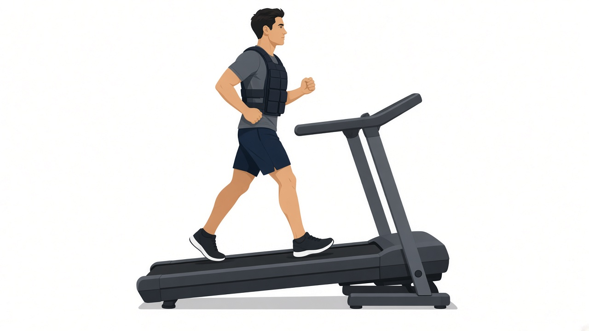
- **Зачем:** гоночная специфика — на Ачишхо все подъёмы пешком с палками. Концентрическая сила без ударной нагрузки.
- **ИП:** дорожка 8–15%, стоишь **всей стопой** на ленте, корпус наклонён ~10° **от голеностопа** (не от поясницы), руки согнуты 90°.
- **Движение:** короткий частый шаг (100–110 шагов/мин), активная работа руками как палками (можно гантели 1 кг). Скорость подбирать по ЧСС (Z2): 15% → 4.5–5 км/ч, 12% → 5–5.5, 8–10% → 5.5–6.
- **Темп и дыхание:** говорить короткими фразами; пульс лезет в Z3 — снижай **скорость**, не угол.
- **Ошибки:** руки на поручнях (теряется вся силовая часть), ходьба на носках (перегруз ахилла), сгорбленная спина.
- **Легче / тяжелее:** ниже угол/скорость; +жилет 5–10 кг (с января), палки в руках.

### Стеймастер (бесконечная лестница)
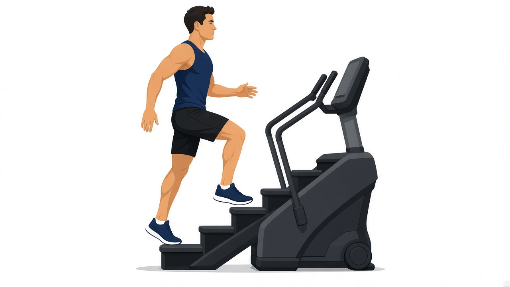
- **Зачем:** вертикаль (D+ = ступени × 0.2 м), силовая выносливость ягодичных и квадрицепсов.
- **ИП:** корпус прямой, лёгкий наклон вперёд, руки свободны или чуть касаются поручней для страховки.
- **Движение:** полная стопа на ступень, толчок пяткой, колено над стопой. Через каждую ступеньку — при уверенном балансе.
- **Темп и дыхание:** 50–60 ступ/мин, Z2.
- **Ошибки:** висеть на поручнях, «семенить» на носках, круглить спину, смотреть в ноги.
- **Легче / тяжелее:** каждая ступень / через одну; +жилет.

### Спуск по лестнице шагом и бегом (стадион, мост)
- **Зачем:** самая доступная в городе эксцентрика — чистое имитирование горного спуска.
- **ИП:** стоя на верхней ступени, корпус чуть вперёд, взгляд на 3–4 ступени вниз.
- **Движение:** шагом — контролируемо опускать тело на согнутом опорном колене, пятка не «падает»; бегом — короткий быстрый шаг на середину стопы, колено мягкое, руки широко. Вверх — шагом или бегом как восстановление.
- **Темп и дыхание:** вниз без спешки, темп задаёт контроль; спуск = рабочая часть, подъём = отдых.
- **Ошибки:** прямое колено, приземление на пятку, наклон назад, перепрыгивание ступеней на усталости.
- **Легче / тяжелее:** шагом → трусцой → бегом; +жилет 5–15 кг; больше кругов.

### Горные ускорения / страйды
- **Зачем:** нейромышечная «острота», частота шага, экономичность — без закисления.
- **ИП:** дорожка 6–8% или пологий подъём на улице; после разминки.
- **Движение:** плавный разгон за 5 с до ~85% усилия, 15–20 с держать частоту и лёгкость, плавное замедление. Между — 60–90 с шаг.
- **Темп и дыхание:** не спринт; должен оставаться контроль и «пружина».
- **Ошибки:** старт рывком, закисление, сутулость на подъёме.
- **Легче / тяжелее:** 4 × 15 с на 4% → 6 × 20 с на 8%.

---

## 🦵 Ноги: эксцентрика и сила

### Темповый присед (гоблет / штанга)
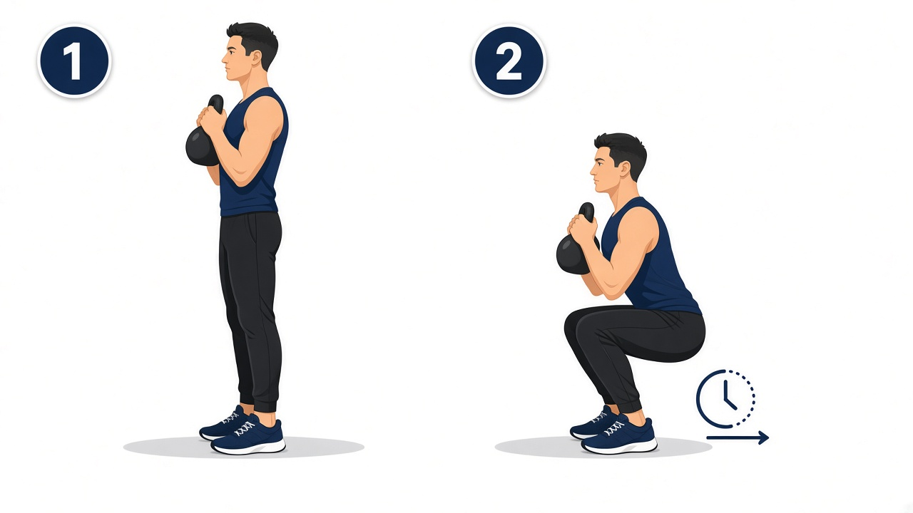
- **Зачем:** учит квадрицепсы работать в удлинении под контролем — база всей программы спусков.
- **ИП:** стопы чуть шире таза, носки слегка наружу; гиря вертикально у груди (гоблет) или штанга на спине/груди. Грудь вверх, взгляд вперёд.
- **Движение:** садиться **медленно 4–5 с**: колени вперёд-наружу над стопами, таз назад-вниз, спина нейтральна, пятки прижаты. Глубина — бёдра ниже параллели при сохранении спины. Вверх за 1 с.
- **Темп и дыхание:** 4-0-1 (или 5-0-1); вдох сверху, задержка на спуске, выдох при подъёме.
- **Ошибки:** колени внутрь, отрыв пяток, «клюёт» поясница внизу, быстрый провал вниз (теряется смысл).
- **Легче / тяжелее:** без веса → гоблет 16–24 кг → штанга 60–70% с 5-с негативом.

### Фронтальный присед со штангой
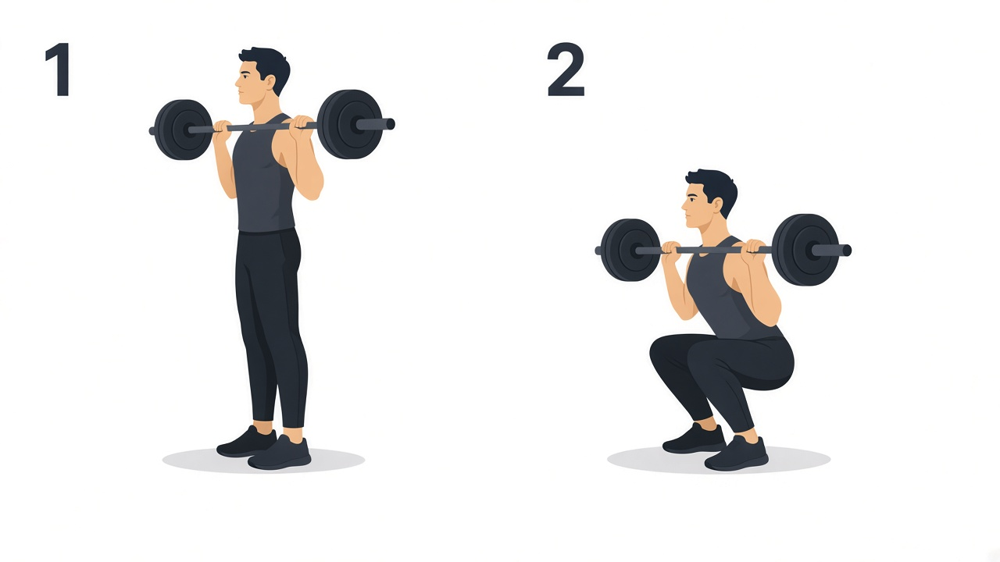
- **Зачем:** сила квадрицепсов в вертикальном корпусе (как на спуске), меньше нагрузка на поясницу, чем в классике.
- **ИП:** штанга на передних дельтах, локти высоко вперёд, пальцы под грифом (или скрестный хват). Стопы чуть шире таза.
- **Движение:** сесть вертикально вниз, колени вперёд над носками, корпус максимально прямой, до параллели и ниже. Встать, ведя локти вверх.
- **Темп и дыхание:** 3-0-1 в блоке Сила I, 5×5 75–80% в Сила II; вдох и «замок» кора сверху.
- **Ошибки:** локти падают → гриф скатывается, округление грудного отдела, пятки.
- **Легче / тяжелее:** гоблет → пустой гриф → рабочий вес; пауза внизу 2 с.

### Сплит-присед с гантелями
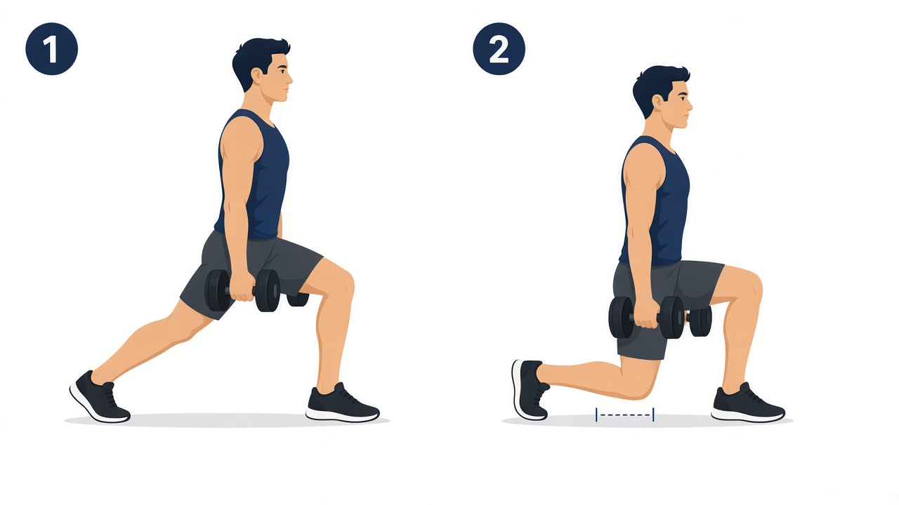
- **Зачем:** одноногая сила и стабильность колена под нагрузкой; медленный спуск = эксцентрика передней ноги.
- **ИП:** длинный шаг вперёд, задняя нога на носке, гантели в руках вдоль тела, корпус прямой.
- **Движение:** опускаться **строго вниз** 3–4 с: заднее колено к полу до 5 см, переднее бедро параллельно, переднее колено над стопой. Встать за 1 с, стопы не переставлять.
- **Темп и дыхание:** 3-1-1; выдох на подъёме.
- **Ошибки:** корпус летит вперёд, переднее колено внутрь, короткая стойка (пятка отрывается), покачивание.
- **Легче / тяжелее:** без веса → гантели → задняя стопа на тумбе 20 см (болгарский вариант).

### Выпад назад
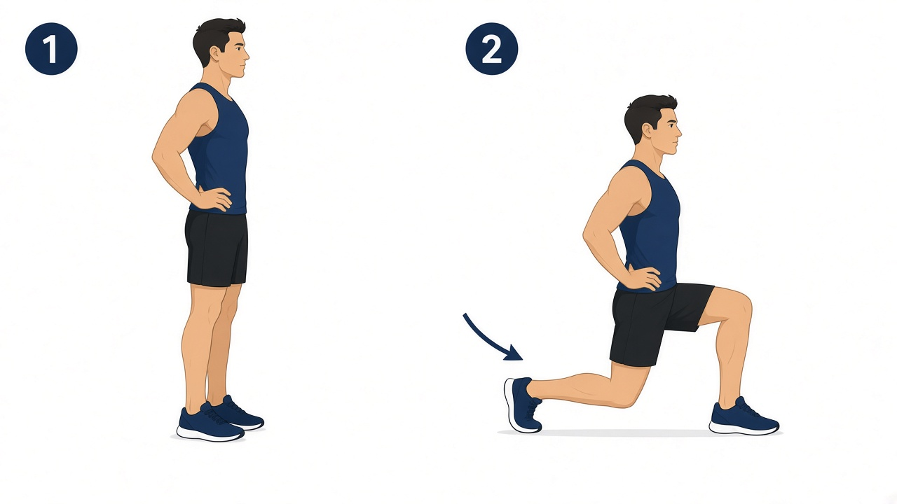
- **Зачем:** безопаснее выпада вперёд для колена; контролируемое опускание = эксцентрика; баланс.
- **ИП:** стоя, стопы вместе или на ширине таза, руки на поясе / гантели / жилет.
- **Движение:** длинный шаг **назад**, опускать заднее колено до 3–5 см от пола за 2–3 с, переднее колено над стопой, корпус прямой. Толчок передней пяткой — вернуться.
- **Темп и дыхание:** 3-0-1; вдох на шаге, выдох на подъёме.
- **Ошибки:** короткий шаг (колено далеко за носок), наклон вперёд, потеря баланса из-за узкой постановки.
- **Легче / тяжелее:** рука у стены; с жилетом 5–15 кг; «шагающий» вариант в круге силовой выносливости.

### Step-down с тумбы (эксцентрический)
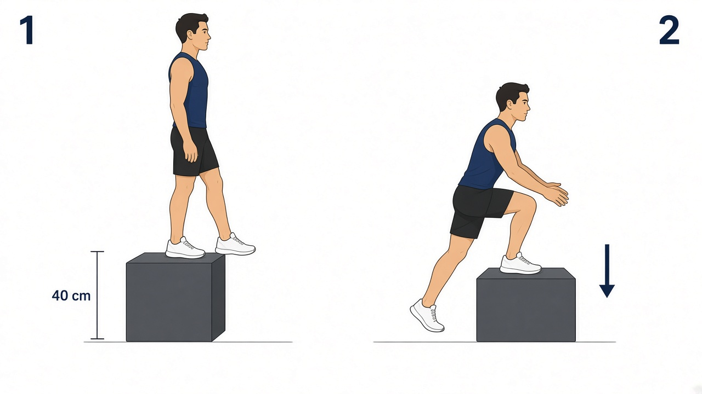
- **Зачем:** ключевое упражнение спуска: точная имитация шага вниз по склону, чистая эксцентрика одной ноги.
- **ИП:** стоишь на тумбе 30–50 см на одной ноге у переднего края, вторая свисает впереди, корпус чуть вперёд, руки вперёд для баланса.
- **Движение:** сгибая опорное колено и таз, **медленно 3–4 с** опускать свободную пятку до касания пола (не переносить на неё вес!), опорное колено над 2–3 пальцем стопы, таз ровный. Вернуться за 1 с той же ногой.
- **Темп и дыхание:** 3-0-1 → 4-0-1; ровное дыхание, без задержек.
- **Ошибки:** колено внутрь, таз «падает» на сторону свободной ноги, приземление на пол весом, толчок свободной ногой при подъёме, быстрое падение.
- **Легче / тяжелее:** 20 см → 30 → 40 → 50 см; +жилет 5 → 10 → 15 кг; пауза 2 с внизу.

### Боковой step-down
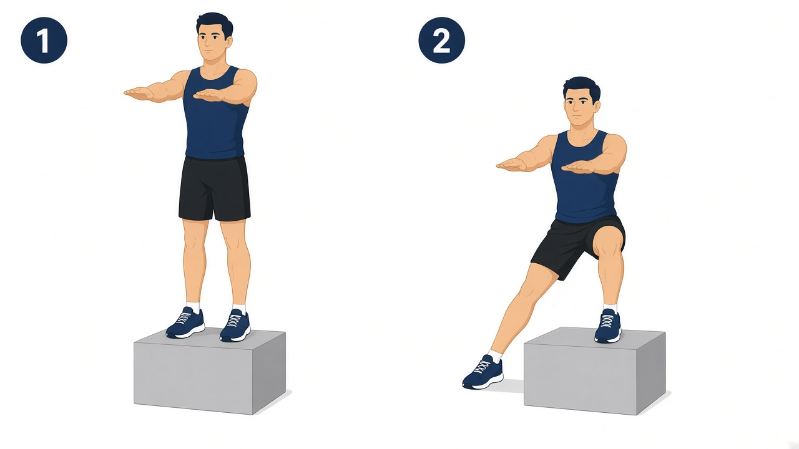
- **Зачем:** контроль колена во фронтальной плоскости (устойчивость на неровной тропе), средняя ягодичная.
- **ИП:** стоя на краю тумбы 20–30 см на одной ноге, вторая свисает **сбоку**, руки вперёд.
- **Движение:** опускаться, сгибая опорное колено и таз, до касания пяткой пола сбоку (3 с), колено над стопой, таз ровный (гребни подвздошных костей на одной высоте). Вернуться.
- **Темп и дыхание:** 3-0-1.
- **Ошибки:** колено валится внутрь, таз проседает, наклон корпуса в сторону.
- **Легче / тяжелее:** ниже ступень; +жилет; зеркало/видео для контроля.

### Step-up с жилетом
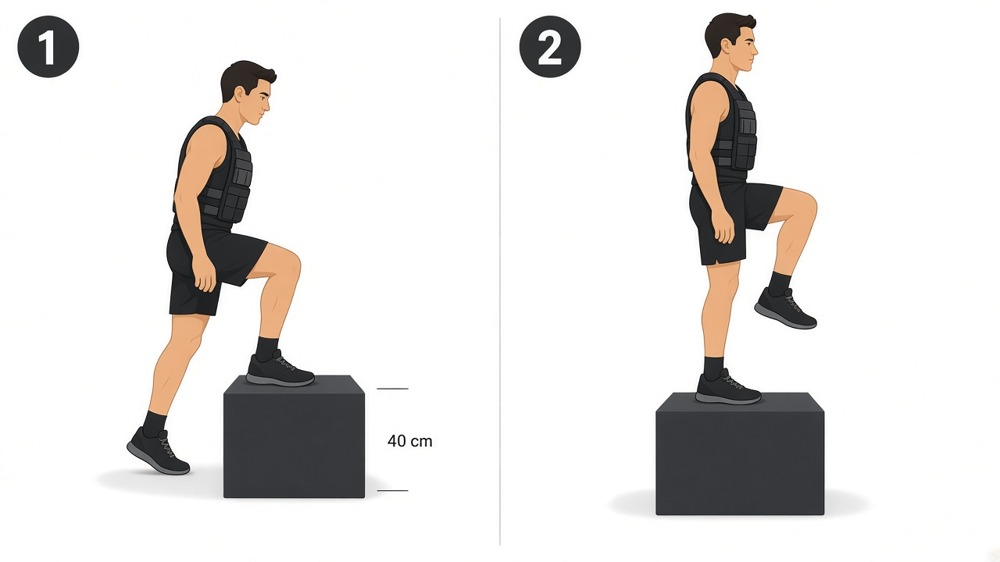
- **Зачем:** сила подъёма с рюкзаком — концентрика для крутых участков 25%+.
- **ИП:** перед тумбой 40 см, одна стопа полностью на тумбе, корпус чуть вперёд.
- **Движение:** давить **пяткой верхней ноги**, подняться до полного выпрямления, нижнюю ногу поднять коленом к тазу без толчка. Опуститься контролируемо 2 с той же ногой.
- **Темп и дыхание:** 1-0-2; выдох на подъёме.
- **Ошибки:** толчок нижней ногой, наклон вперёд с круглой спиной, колено внутрь.
- **Легче / тяжелее:** без жилета / 30 см → жилет 10–15 кг / 50 см.

### Сисси-присед
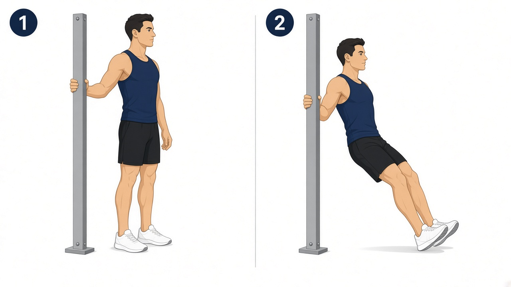
- **Зачем:** изолированная эксцентрика квадрицепса в растянутом положении — точно то, что «выключилось» на Ачишхо.
- **ИП:** стоя, стопы на ширине таза, одной рукой держишься за стойку/стену для баланса.
- **Движение:** одновременно подать колени вперёд, подняться на носки и отклонить прямой корпус назад так, чтобы колени-таз-плечи оставались **одной линией**. Опускаться 3–4 с до ощутимого растяжения квадрицепсов. Вернуться, разгибая колени.
- **Темп и дыхание:** 3-1-1; ровно.
- **Ошибки:** сгибание в тазу (это уже не сисси), рывок, слишком глубоко в первые недели.
- **Легче / тяжелее:** малая амплитуда с опорой двумя руками → полная → без опоры; вариант в тренажёре.

### Reverse Nordic (обратный нордик)
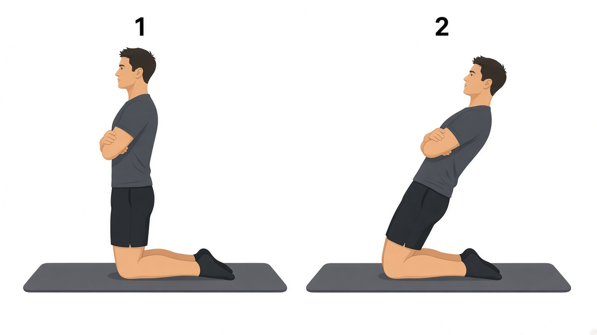
- **Зачем:** эксцентрика квадрицепсов + прямой мышцы бедра, гибкость; «страховка» для коленей на длинных спусках.
- **ИП:** на коленях на коврике, голени и стопы на полу (можно зафиксировать под грифом/скамьёй), таз полностью разогнут, руки скрещены на груди.
- **Движение:** сохраняя бёдра и корпус **одной прямой линией**, отклоняться назад только в коленях, 3–5 с, до предела контроля. Вернуться вперёд усилием квадрицепсов.
- **Темп и дыхание:** 4-0-2; выдох при возврате.
- **Ошибки:** сгибание в тазу (сед на пятки), прогиб поясницы, падение назад.
- **Легче / тяжелее:** руки вперёд как противовес и малая амплитуда → руки на груди → руки за головой → с диском на груди.

### Испанский присед
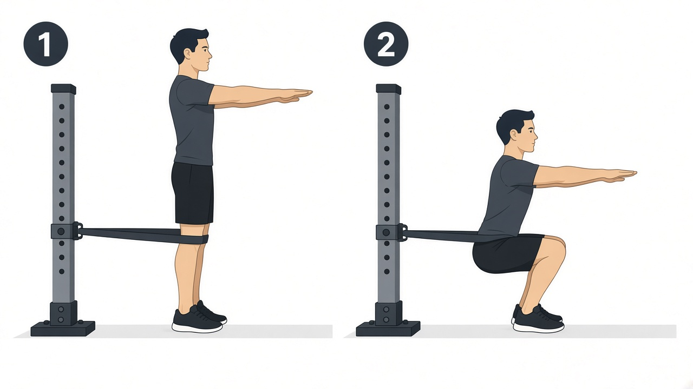
- **Зачем:** нагрузка на квадрицепс при **вертикальной голени** — разгружает колено и сухожилие надколенника, отлично при первой боли под коленом; изометрия для выносливости.
- **ИП:** толстая резина закреплена на стойке на уровне колен, надета **за колени** (под коленной ямкой). Отойти до натяжения, стопы плотно, руки вперёд.
- **Движение:** сесть назад до параллели бёдер, голени остаются вертикальными (резина держит), корпус прямой. Либо динамика 3-1-1, либо изометрия 30–45 с в нижней точке.
- **Темп и дыхание:** медленно; в изометрии дышать свободно.
- **Ошибки:** слабо натянутая резина (голень уходит вперёд), наклон корпуса, отрыв пяток.
- **Легче / тяжелее:** параллель → ниже; +гантель у груди; изометрия до 60 с.

### Изометрия «стульчик» у стены
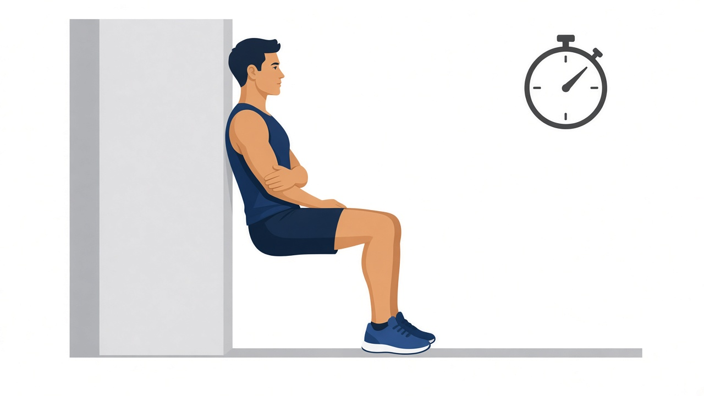
- **Зачем:** выносливость квадрицепсов к длительному напряжению — тест сезона (цель ≥ 2:00 к маю).
- **ИП:** спина плоско к стене, стопы вынесены вперёд так, чтобы колени и таз были под 90°, голени вертикальны, стопы на ширине таза.
- **Движение:** статика. Держать без опоры рук на бёдра, дышать ровно.
- **Темп и дыхание:** 45 с → 120 с; при дрожи — терпеть до потери угла, не до боли в колене.
- **Ошибки:** колени внутрь, отрыв поясницы от стены, угол «выше» 90° для облегчения.
- **Легче / тяжелее:** угол 110° → 90°; +диск/гантель на бёдра; одна нога.

### Одноногий жим ногами с эксцентрикой (2 вверх — 1 вниз)
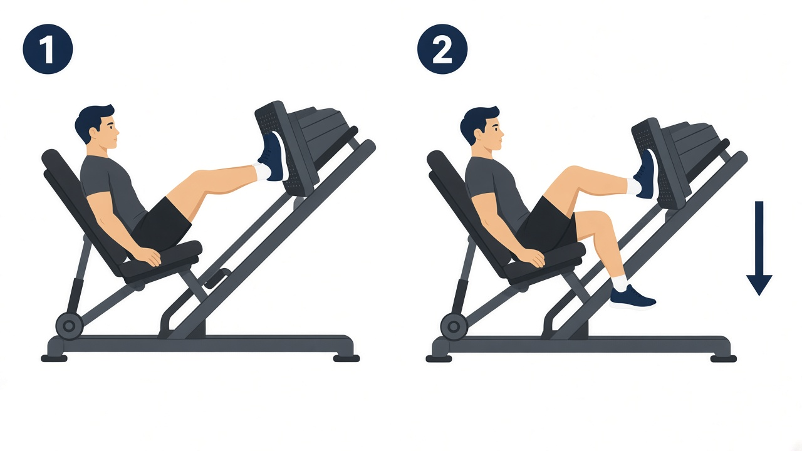
- **Зачем:** безопасная **перегрузка негативной фазы** одной ноги — в приседе такое не воспроизвести.
- **ИП:** спина и таз плотно в сиденье, стопы на платформе на ширине таза. Вес ~70–80% от одноногого максимума (обычно 120–160% от того, что жмёшь одной ногой обычно).
- **Движение:** выжать **двумя** ногами, снять левую, опускать платформу **правой** ногой 4–5 с до угла в колене 90°, поставить левую, выжать двумя. Чередовать ноги.
- **Темп и дыхание:** 1-0-4/5; выдох на жиме.
- **Ошибки:** отрыв таза (колени слишком глубоко), выпрямление колена в «замок» наверху, ускорение внизу.
- **Легче / тяжелее:** лёгкий вес → тяжелее; пауза 2 с внизу.

### Подъём на носки одноногий эксцентрический
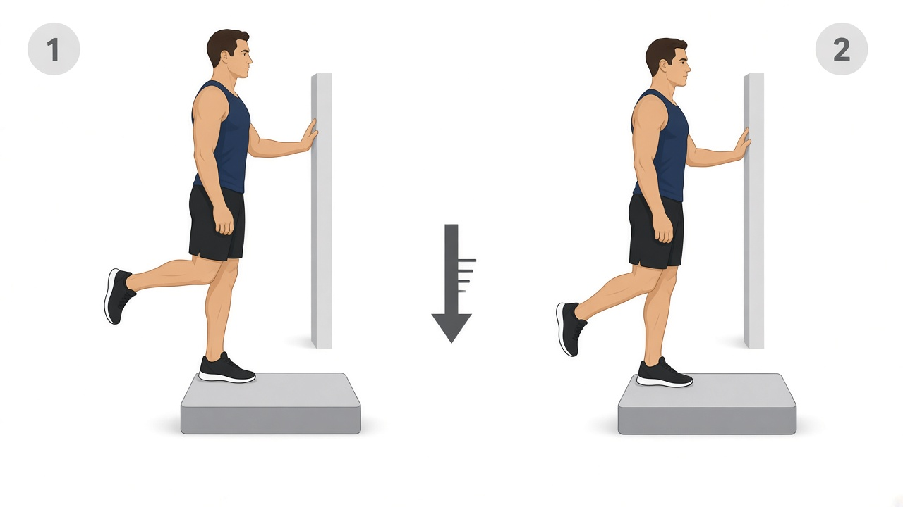
- **Зачем:** икры и ахилл — тормозящие на спуске мышцы; профилактика тендинопатии при работе на 15%.
- **ИП:** носок одной ноги на краю ступени, вторая стопа поднята, рука касается стены только для баланса.
- **Движение:** подняться на носок за 1 с, пауза 1 с, **опускаться 3 с** ниже уровня ступени до растяжения икры. Колено прямое (икра) — или слегка согнутое (камбаловидная) в отдельном подходе.
- **Темп и дыхание:** 1-1-3.
- **Ошибки:** помощь второй ногой, вес на руку, завал пятки внутрь/наружу, «отбив» внизу.
- **Легче / тяжелее:** две ноги → одна → одна с гантелью в руке.

---

## ⚡ Плиометрика

Общие правила: **на свежих** (после разминки, до тяжёлой силовой), 1×/нед, объём 40–80 контактов, приземление **тихое**, полный отдых между сериями (60–90 с). Нет в разгрузочные недели и в тейпере.

### Drop landing (приземление с тумбы)
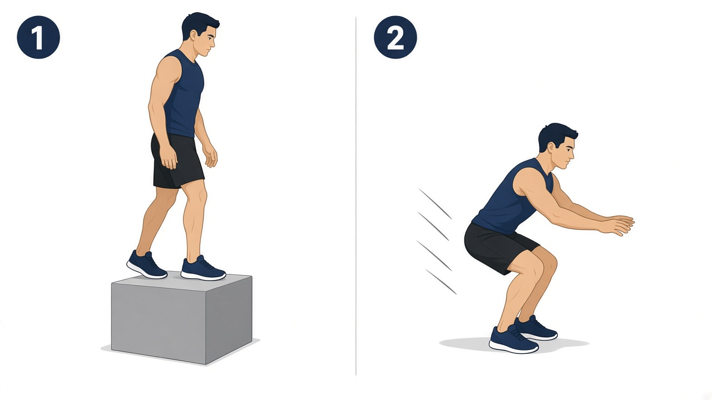
- **Зачем:** учит амортизировать удар — фундамент для всех прыжков и для каждого шага на спуске.
- **ИП:** стоя на тумбе 20–30 см, стопы на ширине таза.
- **Движение:** **шагнуть** (не прыгать) вперёд с тумбы, приземлиться на обе стопы одновременно на середину стопы в четверть-присед: колени над стопами, таз назад, корпус чуть вперёд, руки вперёд. Замереть на 2 с — «прилипнуть». Подняться обратно шагом.
- **Темп и дыхание:** выдох на приземлении.
- **Ошибки:** громкий удар пятками, колени внутрь, прямые ноги, глубокий присед («провал»), приземление одной ногой раньше.
- **Легче / тяжелее:** 20 см → 30 → 40 см; приземление на одну ногу (с 30 см, весна).

### Pogo hops (прыжки на прямых ногах)
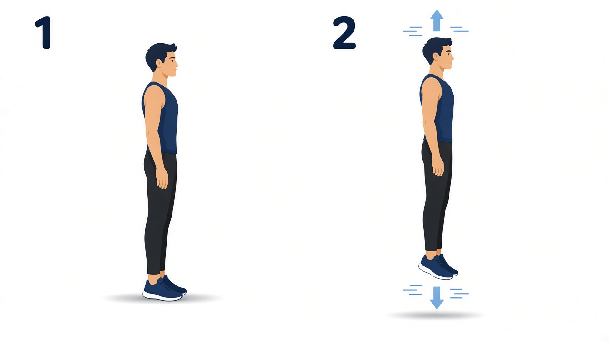
- **Зачем:** жёсткость голеностопа и ахилла, быстрый контакт с землёй — экономичность бега и спусков.
- **ИП:** стоя, ноги почти прямые, на передней части стопы, руки свободно.
- **Движение:** низкие быстрые прыжки 5–10 см только за счёт голеностопа, колени почти не сгибаются, стопа в воздухе «взведена» (носок к себе), контакт минимальный — «горячий пол».
- **Темп и дыхание:** 2 прыжка/с, серии 15–20 с.
- **Ошибки:** сгибание коленей (это уже приседы), пятки касаются пола, долгий контакт.
- **Легче / тяжелее:** на месте → с продвижением вперёд → через низкие препятствия → на одной ноге.

### Depth jump (спрыгивание с последующим прыжком)
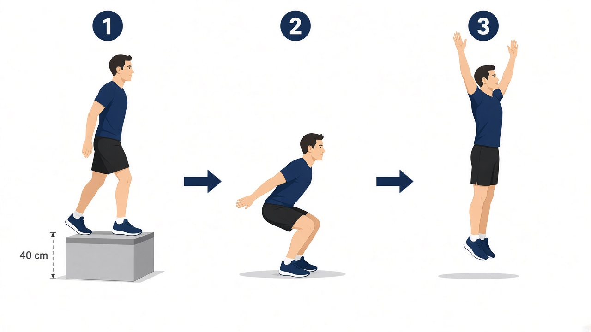
- **Зачем:** реактивная сила: быстрое переключение эксцентрика → концентрика — то, что нужно на техничном спуске.
- **ИП:** стоя на тумбе 30–40 см.
- **Движение:** шагнуть вниз, приземлиться в короткий четверть-присед и **немедленно** выпрыгнуть вверх максимально высоко, руки вверх. Приземление после прыжка — мягкое, «прилипнуть».
- **Темп и дыхание:** контакт с полом ≤ 0.25 с; 3–5 повторов в серии, отдых 90 с.
- **Ошибки:** долгое «сидение» на полу перед прыжком, глубокий присед, приземление на прямые ноги, высокая тумба слишком рано.
- **Легче / тяжелее:** 30 см → 40 см; прыжок вверх → прыжок на вторую тумбу; одноногий вариант с 20–30 см (весна).

### Одноногие прыжки вперёд
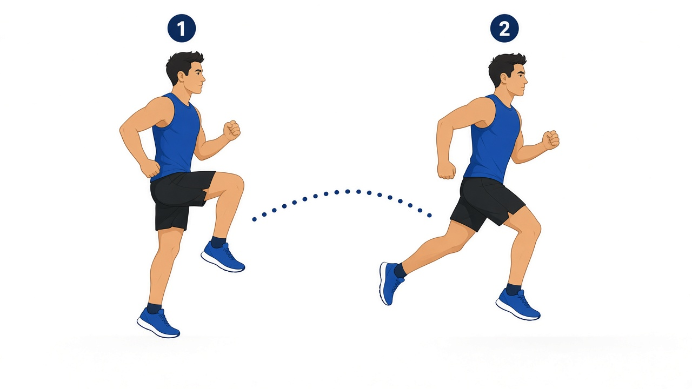
- **Зачем:** сила и стабильность одной ноги при приземлении — каждый шаг на спуске это одноногое приземление.
- **ИП:** стоя на одной ноге, колено слегка согнуто, руки согнуты.
- **Движение:** прыжок вперёд на 0.5–1 м с приземлением на **ту же** ногу, мягко, колено над стопой, замереть 1 с, следующий. 5–8 прыжков — серия, поменять ногу.
- **Темп и дыхание:** контроль важнее дальности.
- **Ошибки:** колено внутрь при приземлении, потеря баланса, наклон корпуса, приземление на пятку.
- **Легче / тяжелее:** с паузой → без паузы (bounding) → через линии/низкие препятствия.

### Боковые прыжки на одну ногу (skater hop)
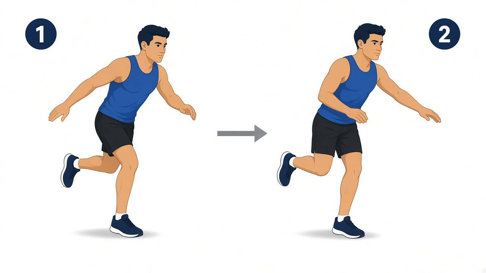
- **Зачем:** фронтальная стабильность колена и голеностопа на неровной тропе, камнях, боковом спуске.
- **ИП:** стоя на одной ноге в полуприседе, вторая слегка отведена назад, руки готовы.
- **Движение:** прыжок в сторону на 0.5–1 м, приземление на **другую** ногу мягко, колено над стопой, таз ровный, пауза 1 с — прыжок обратно.
- **Темп и дыхание:** 8–10 в каждую сторону.
- **Ошибки:** колено валится внутрь, касание второй ногой пола, корпус наклоняется к опорной ноге.
- **Легче / тяжелее:** ближе/дальше; без паузы; приземление на подушку/BOSU (весна).

---

## 💪 Верх тела (плечевой пояс для палок)

### Подтягивания
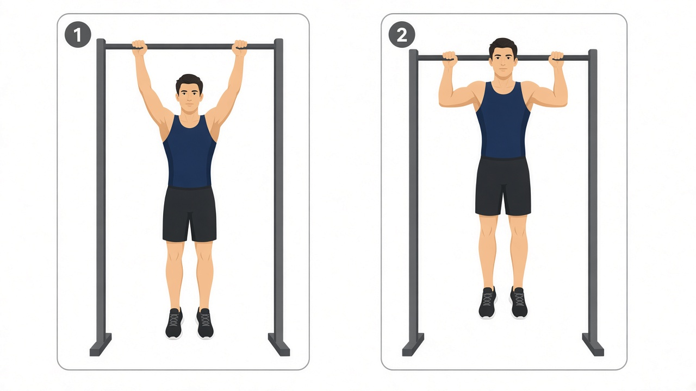
- **Зачем:** тяговая сила спины и рук — толчок палками на подъёме 7 часов подряд.
- **ИП:** вис на перекладине, хват сверху чуть шире плеч, плечи опущены от ушей, тело прямое.
- **Движение:** начать с сведения лопаток вниз, затем тянуть локтями вниз-назад, подбородок над перекладиной, грудь к перекладине. Опускание **2–3 с** до полного виса.
- **Темп и дыхание:** 1-0-2; выдох на подъёме.
- **Ошибки:** раскачка, подбородок «тянется» шеей, неполная амплитуда внизу, плечи к ушам.
- **Легче / тяжелее:** резина (петля под стопу) → негативы 5 с → чистые → с паузой вверху.

### Тяга в кольцах / TRX
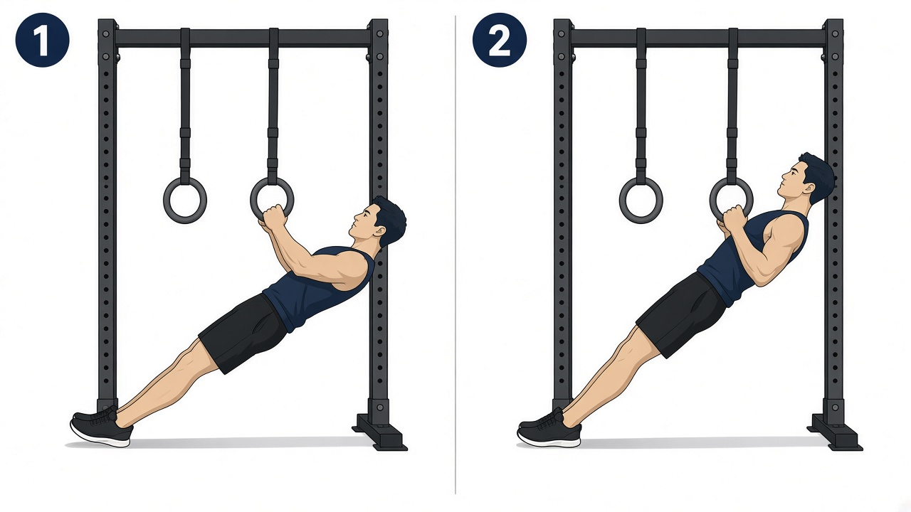
- **Зачем:** горизонтальная тяга без нагрузки на поясницу (замена тяги в наклоне, которая исключена).
- **ИП:** кольца на уровне пояса, взять, отклониться назад на прямых руках, тело — жёсткая линия от пяток до головы, пятки на полу.
- **Движение:** тянуть кольца к нижним рёбрам, локти назад вдоль тела, лопатки свести, пауза 1 с. Опускание 2 с.
- **Темп и дыхание:** 1-1-2.
- **Ошибки:** провисание таза, плечи к ушам, рывок, короткая амплитуда.
- **Легче / тяжелее:** чем вертикальнее тело — легче; горизонтально, стопы на тумбе — тяжелее; одной рукой.

### Отжимания
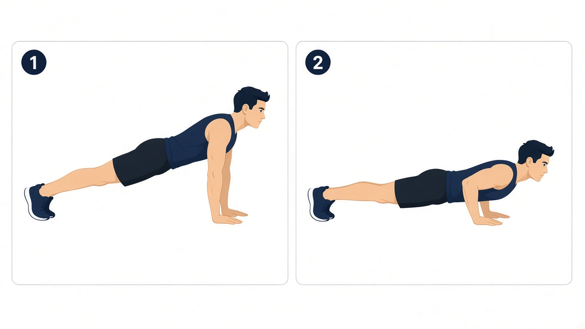
- **Зачем:** жимовая сила и жёсткий кор (перенос на палки: толчок вниз-назад).
- **ИП:** упор лёжа, ладони под плечами, тело — одна линия, стопы вместе, взгляд чуть вперёд.
- **Движение:** опускаться 2 с, локти назад под 45° к телу, грудь до 5 см от пола, выжать за 1 с без рывка тазом.
- **Темп и дыхание:** 2-0-1; вдох вниз, выдох вверх.
- **Ошибки:** таз провисает или задран, локти в стороны 90°, голова вниз, неполная амплитуда.
- **Легче / тяжелее:** руки на тумбе / с колен → классика → стопы на тумбе → с жилетом.

### Жим гантелей стоя
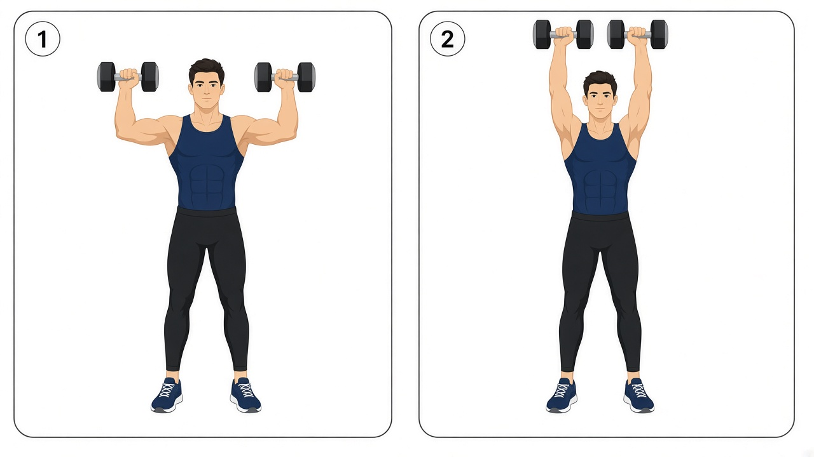
- **Зачем:** плечи и трицепс — вынос палок вперёд-вверх на крутом.
- **ИП:** стоя, стопы на ширине таза, колени мягкие, гантели у плеч, локти чуть впереди, рёбра «вниз», пресс напряжён.
- **Движение:** выжать вверх по слегка дуговой траектории до прямых рук над головой (бицепс у уха), опустить за 2 с.
- **Темп и дыхание:** 1-0-2; выдох на жиме.
- **Ошибки:** прогиб поясницы (жим «животом»), толчок ногами, локти вперёд слишком сильно.
- **Легче / тяжелее:** сидя с опорой → стоя → одной рукой (см. ниже).

### Жим гантели одной рукой стоя
- **Зачем:** жим + антибоковой кор одновременно (как удержание корпуса при толчке одной палкой).
- **ИП:** одна гантель у плеча, вторая рука свободна или на поясе; стопы на ширине таза, пресс напряжён.
- **Движение:** выжать вверх, корпус **не заваливать** в сторону от гантели, опустить за 2 с. Все повторы одной рукой, затем другой.
- **Темп и дыхание:** 1-0-2.
- **Ошибки:** наклон корпуса от веса, прогиб поясницы, толчок ногами.
- **Легче / тяжелее:** легче вес; стоя на одной ноге (баланс).

### Жим гантелей лёжа
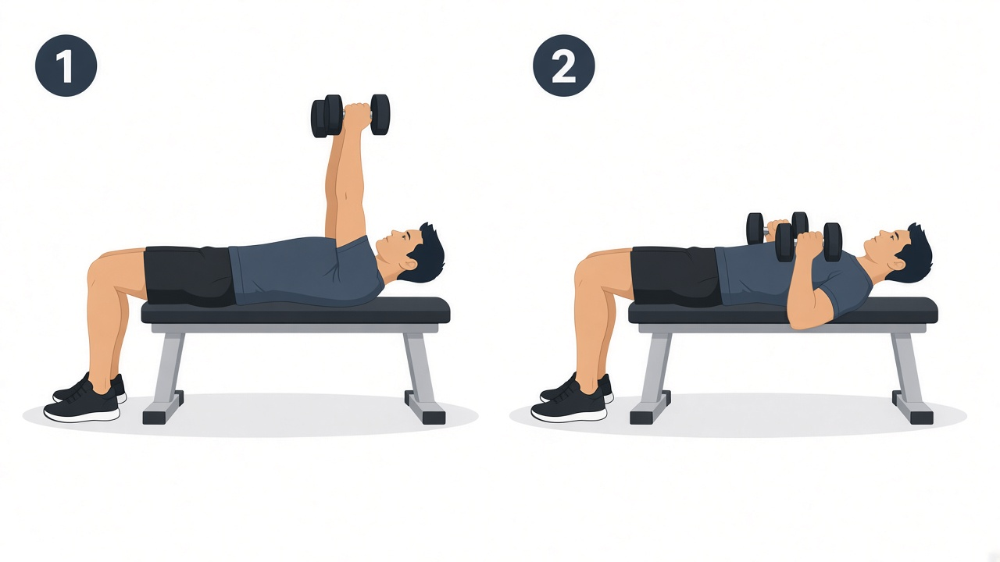
- **Зачем:** общая жимовая сила груди и трицепса.
- **ИП:** лёжа на скамье, стопы плотно в пол, лопатки сведены и прижаты, гантели над грудью на прямых руках.
- **Движение:** опускать 2–3 с до уровня груди, локти под 45–60° к телу, выжать вверх, гантели чуть сближаются наверху.
- **Темп и дыхание:** 2-0-1.
- **Ошибки:** локти строго в стороны 90° (плечи), отбив, отрыв таза, потеря сведения лопаток.
- **Легче / тяжелее:** наклонная скамья 30° — акцент на верх груди; вес такой, что +4 повтора в запасе.

### Тяга верхнего блока к груди
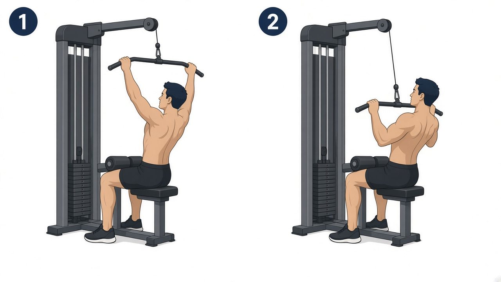
- **Зачем:** широчайшие — основная мышца толчка палками; контролируемая альтернатива подтягиваниям.
- **ИП:** сидя, бёдра под валиком, хват широкий, лёгкий наклон назад 10°, грудь вверх.
- **Движение:** тянуть рукоять к верху груди, локти вниз-назад, лопатки свести внизу, пауза 1 с. Возврат медленно до полного растяжения широчайших.
- **Темп и дыхание:** 1-1-2.
- **Ошибки:** откидывание корпуса назад (это уже гребля), плечи к ушам, тяга бицепсом с прямыми лопатками.
- **Легче / тяжелее:** вес; узкий обратный хват; одной рукой в кроссовере.

---

## 🧘 Кор

### Dead bug
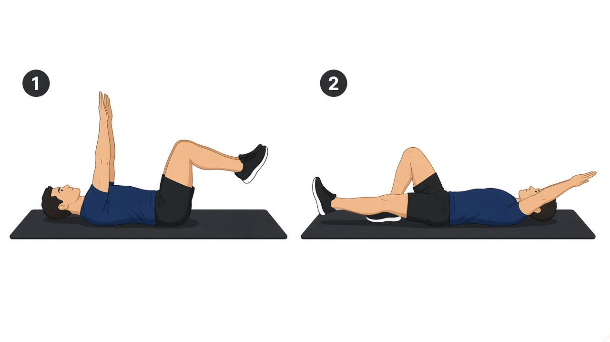
- **Зачем:** антиразгибание — поясница под контролем, когда ноги работают (каждый шаг вниз).
- **ИП:** лёжа на спине, руки вверх, бёдра и колени под 90°, **поясница прижата к полу**.
- **Движение:** на выдохе медленно опустить правую руку за голову и выпрямить левую ногу до 5 см от пола; вдох — вернуть; поменять сторону. Поясница не отрывается ни на миллиметр.
- **Темп и дыхание:** 3 с туда, 3 с обратно; выдох на разгибании.
- **Ошибки:** поясница прогибается (→ уменьшить амплитуду), задержка дыхания, быстрые махи.
- **Легче / тяжелее:** только ноги / только руки → полный → с резиной над головой.

### Планка на локтях
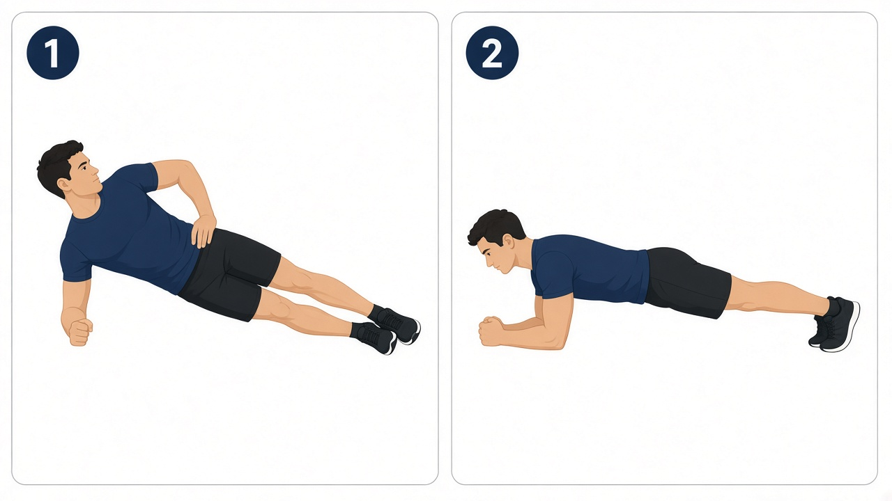
- **Зачем:** базовая жёсткость корпуса.
- **ИП:** локти под плечами, предплечья параллельно или кисти вместе, стопы на ширине таза, тело — одна линия (панель 2).
- **Движение:** статика: таз подкручен (поясница плоская), ягодицы и пресс напряжены, пятки тянутся назад, взгляд в пол.
- **Темп и дыхание:** 30–60 с, дышать ровно, не задерживать.
- **Ошибки:** провисание таза, задранный таз, голова вверх, плечи к ушам.
- **Легче / тяжелее:** с колен → классика → с попеременным подъёмом ноги / на прямых руках с касанием плеча.

### Боковая планка
- **Зачем:** антибоковой кор — стабильность таза при одноногой опоре на спуске.
- **ИП:** лёжа на боку, локоть точно под плечом, стопы одна на другой (или колено на полу — облегчённо), свободная рука на поясе (панель 1).
- **Движение:** поднять таз до прямой линии от головы до стоп, бёдра не откатываются назад. Вариант: подъём-опускание таза 10 раз.
- **Темп и дыхание:** 30–45 с/сторону, ровное дыхание.
- **Ошибки:** таз «висит», корпус скручен вперёд, плечо ползёт к уху.
- **Легче / тяжелее:** колено на полу → стопы → с подъёмом верхней ноги / с диском на бедре.

### Bird dog
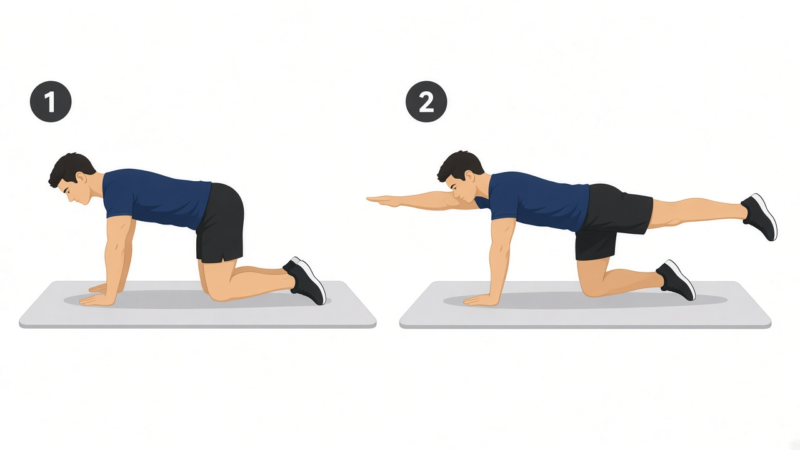
- **Зачем:** координация «противоположная рука — нога» + стабильность таза без движения поясницы.
- **ИП:** на четвереньках, кисти под плечами, колени под тазом, спина нейтральна, взгляд в пол.
- **Движение:** одновременно вытянуть правую руку вперёд и левую ногу назад до линии с корпусом, таз не разворачивать (представь стакан воды на пояснице), пауза 2 с, вернуться не касаясь пола, повторить, затем сменить сторону.
- **Темп и дыхание:** медленно; выдох на вытяжении.
- **Ошибки:** нога выше спины (прогиб поясницы), таз разворачивается, спина округляется.
- **Легче / тяжелее:** только рука/только нога → полный → с резиной между кистью и стопой.

### Hollow hold
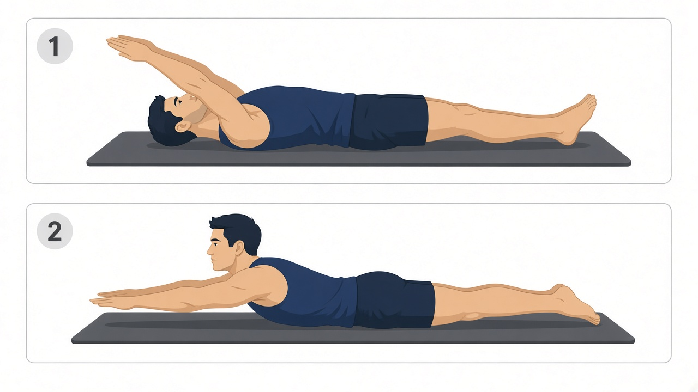
- **Зачем:** передняя цепь — «жёсткий цилиндр» корпуса при ударной нагрузке.
- **ИП:** лёжа на спине, поясница прижата, руки вверх за голову у ушей, ноги прямые вместе (панель 1).
- **Движение:** оторвать лопатки и ноги (стопы на 20–30 см от пола), тело — плавная «банана», поясница **не отрывается**. Держать.
- **Темп и дыхание:** 20–45 с, дыхание поверхностное, но непрерывное.
- **Ошибки:** поясница отрывается (→ ноги выше или согнуть колени), подбородок к груди с напряжением шеи, руки вперёд.
- **Легче / тяжелее:** колени согнуты, руки вдоль тела → прямые ноги, руки вверх → покачивания (hollow rock).

### Superman
- **Зачем:** задняя цепь (разгибатели спины, ягодичные) — антипод hollow, баланс передней и задней стенки.
- **ИП:** лёжа лицом вниз, руки вперёд, ноги прямые (панель 2 на иллюстрации выше).
- **Движение:** одновременно приподнять грудь и бёдра на 5–10 см, руки и ноги тянутся в длину, шея нейтральна (взгляд в пол). Держать 20–30 с или 10–12 подъёмов с паузой 2 с.
- **Темп и дыхание:** ровно, без задержек.
- **Ошибки:** запрокидывание головы, рывок, слишком высокий подъём («лодочка» до боли в пояснице).
- **Легче / тяжелее:** попеременно рука-нога → полный → с паузами 5 с.

### Pallof press
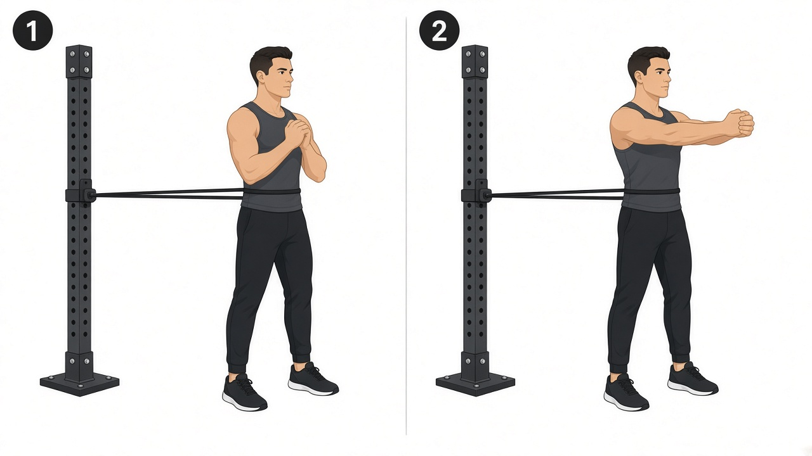
- **Зачем:** антиротация — корпус не скручивается при односторонней работе палками и на камнях.
- **ИП:** резина закреплена на уровне груди сбоку, стоишь боком к ней, стопы на ширине плеч, руки с резиной у центра груди, резина натянута.
- **Движение:** выжать руки прямо перед собой, 2 с удержать — резина тянет в сторону, ты не позволяешь корпусу и тазу повернуться. Вернуть к груди медленно.
- **Темп и дыхание:** 1-2-2; выдох на жиме.
- **Ошибки:** плечи/таз поворачиваются к стойке, наклон корпуса, слабо натянутая резина.
- **Легче / тяжелее:** ближе к стойке — легче; шаг вперёд/назад с выжатыми руками; на одном колене; стоя на одной ноге.

---

## 🦶 Баланс и стопа

### Стойка на одной ноге с закрытыми глазами
- **Зачем:** проприоцепция голеностопа — контроль стопы на камнях без зрительной поддержки (ночь!).
- **ИП:** стоя на одной ноге, опорное колено слегка согнуто, стопа «трёхточечная» (пятка, основание большого пальца и мизинца), руки свободно.
- **Движение:** закрыть глаза, держать 30 с; мелкие движения стопы — норма, корпус спокоен. При потере — коснуться пола и продолжить, не открывая глаз.
- **Темп и дыхание:** ровное.
- **Ошибки:** зажатые пальцы стопы «когтями», прямое колено в замке, наклон корпуса.
- **Легче / тяжелее:** глаза открыты → закрыты → на подушке → повороты головы.

### Стойка на BOSU на одной ноге + «часы»
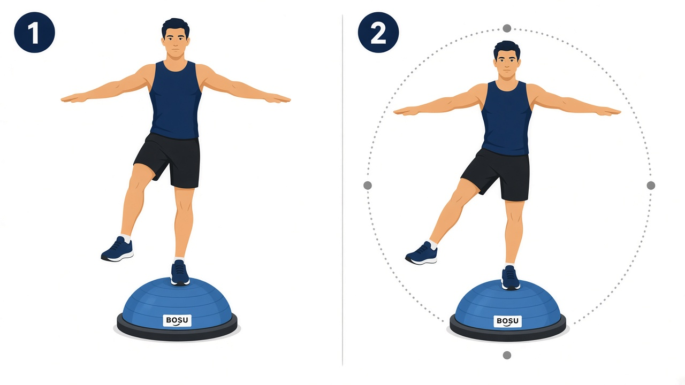
- **Зачем:** динамический баланс на нестабильной опоре — постановка стопы на неровную тропу.
- **ИП:** на куполе BOSU на одной ноге, колено чуть согнуто, руки в стороны, взгляд вперёд.
- **Движение:** свободной ногой медленно тянуться носком к 12 → 3 → 6 → 9 часам (не касаясь пола), таз ровный, корпус не крутится. 30 с/нога или 2 круга.
- **Темп и дыхание:** медленно.
- **Ошибки:** корпус наклоняется за ногой, опорное колено внутрь, задержка дыхания.
- **Легче / тяжелее:** на полу → подушка → BOSU → BOSU с закрытыми глазами.

### «Часы» стопой на полу
- **Зачем:** то же, что выше, стартовый уровень; плюс контроль колена в приседе на одной ноге.
- **ИП:** стоя на одной ноге, опорное колено согнуто 20–30°.
- **Движение:** свободной стопой касаться пола по кругу: 12 → 3 → 6 → 9 — одно повторение; при каждом касании опорное колено чуть глубже сгибается и остаётся над стопой.
- **Темп и дыхание:** 2 с на касание.
- **Ошибки:** перенос веса на касающуюся ногу, наклон таза, колено внутрь.
- **Легче / тяжелее:** касания ближе → дальше; с гантелями в руках.

### Ходьба по линии (пятка к носку) с закрытыми глазами
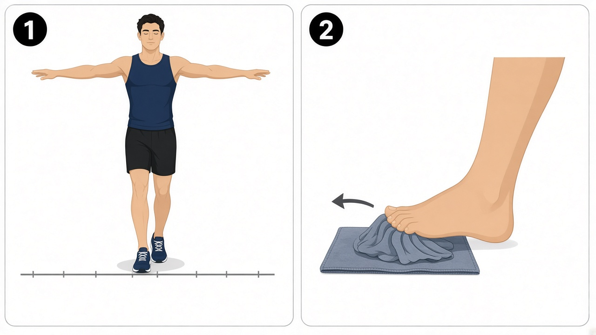
- **Зачем:** вестибулярный контроль, узкая постановка — гребни и узкая тропа в темноте.
- **ИП:** найти линию на полу, встать на неё, руки в стороны (панель 1).
- **Движение:** идти, ставя пятку вплотную к носку другой ноги; первые 2–3 шага с открытыми глазами, затем закрыть. 10 м вперёд, затем 10 м **назад** спиной.
- **Темп и дыхание:** медленно, пауза 1 с на каждом шаге.
- **Ошибки:** широкая постановка, взгляд в пол, задержка дыхания.
- **Легче / тяжелее:** глаза открыты → закрыты → назад → с поворотами головы.

### Боковые шаги с резиной на голенях
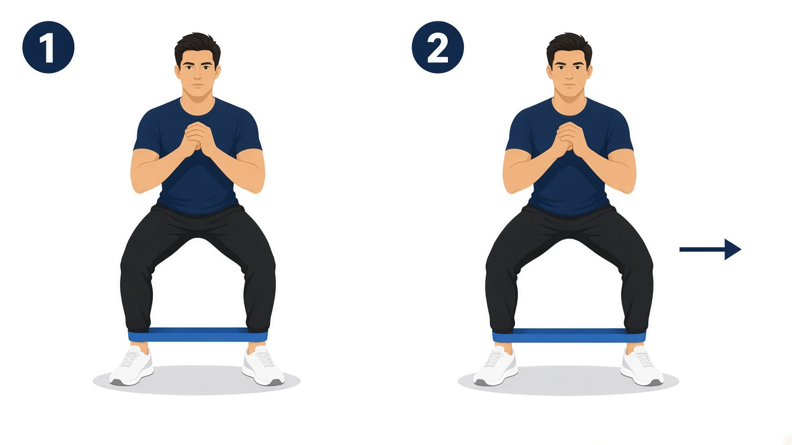
- **Зачем:** средняя ягодичная — стабилизатор колена на спуске (колено внутрь = перегруз связок).
- **ИП:** мини-резина чуть выше лодыжек, стопы на ширине плеч (резина натянута), полуприсед, корпус чуть вперёд, руки у груди.
- **Движение:** шаг в сторону на 30–40 см ведущей ногой, приставить вторую **не до конца** (резина всегда натянута). Стопы параллельно, колени наружу. 10 шагов в одну сторону, 10 обратно.
- **Темп и дыхание:** контроль, без «шлёпания».
- **Ошибки:** корпус выпрямляется, колени внутрь, стопы разворачиваются, шаги подпрыгивающие.
- **Легче / тяжелее:** резина выше колен → на голенях → на стопах; двойная резина.

### Сгибание пальцев стопы с полотенцем
- **Зачем:** короткие мышцы стопы — «активная стопа» держит свод на длинных спусках.
- **ИП:** сидя, босая стопа на краю расстеленного полотенца, пятка на полу (панель 2 выше).
- **Движение:** пальцами «сгребать» полотенце под себя, пятка на месте — одно сгребание = повтор. 15 раз, затем разгладить полотенце пальцами обратно (разгибание).
- **Темп и дыхание:** медленно.
- **Ошибки:** помощь голеностопом, пятка ползёт, зажим коленом.
- **Легче / тяжелее:** без утяжеления → книга/гантель 1–2 кг на полотенце.

---

## 🚣 Кардиотренажёры (силовая выносливость для палок)

### Гребной тренажёр
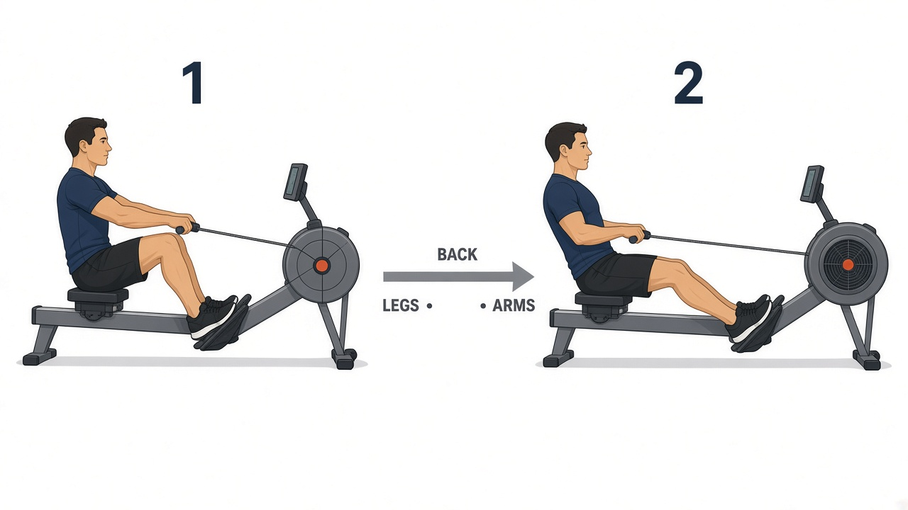
- **Зачем:** аэробная работа + тяга спиной и руками — выносливость плечевого пояса для палок без ударной нагрузки на ноги.
- **ИП (захват):** сиденье впереди, голени вертикальны, руки прямые, корпус наклонён вперёд от таза ~1 час (на циферблате), спина ровная.
- **Движение:** последовательность **ноги → корпус → руки**: толчок ногами, когда ноги почти прямые — корпус откидывается до «11 часов», затем руки тянут рукоять к нижним рёбрам. Возврат в обратном порядке: руки → корпус → ноги, медленно (соотношение 1:2).
- **Темп и дыхание:** 22–26 гр/мин в Z1–Z2; выдох на тяге.
- **Ошибки:** руки и корпус стартуют раньше ног, круглая спина, тяга к подбородку, рывковый возврат.
- **Легче / тяжелее:** сопротивление (damper) 3–5; интервалы 4×4 мин → 30 мин ровно → 500 м отрезки.

### Ски-эрг
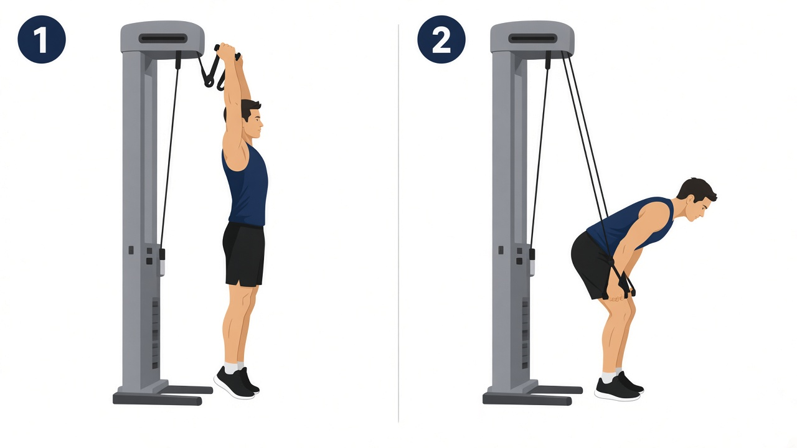
- **Зачем:** **почти точная имитация толчка палками** (двойное отталкивание): широчайшие, трицепс, кор, сгибатели бедра.
- **ИП:** стоя перед тренажёром на расстоянии вытянутых рук, стопы на ширине таза, рукояти вверху над головой, лёгкий подъём на носки.
- **Движение:** тянуть вниз за счёт **складывания корпуса** (наклон в тазу + сгибание коленей) с одновременным сгибанием рук; руки заканчивают у бёдер сзади. Возврат — разгибание корпуса и вынос рук вверх, плавно.
- **Темп и дыхание:** длинный мах, 35–45 тяг/мин в Z2; выдох на тяге.
- **Ошибки:** тяга только руками при прямом корпусе, круглая спина, колени в замке, короткая амплитуда.
- **Легче / тяжелее:** сопротивление; попеременная тяга (одна рука) — имитация одиночной палки; интервалы.

---

## 🔄 Мобилити и восстановление

### Кошка-корова
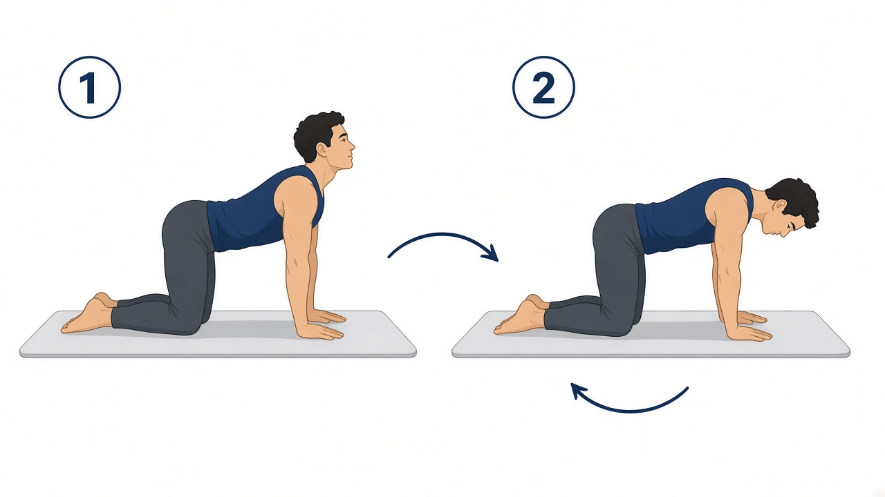
- **Зачем:** подвижность грудного и поясничного отдела после долгого корпуса «вперёд» на подъёмах.
- **ИП:** на четвереньках, кисти под плечами, колени под тазом.
- **Движение:** вдох — прогнуть спину вниз, грудь раскрыть, взгляд вперёд (корова); выдох — округлить спину вверх, подбородок к груди, таз подкрутить (кошка). 10 циклов.
- **Темп и дыхание:** 3–4 с на фазу, движение ведёт дыхание.
- **Ошибки:** движение только шеей, рывки, локти в замке с переразгибанием.
- **Легче / тяжелее:** —

### 90/90 бёдра
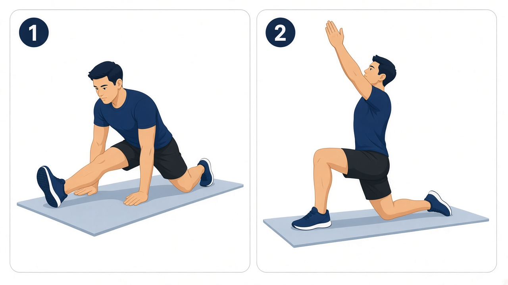
- **Зачем:** внутренняя и наружная ротация бедра — свобода шага на технике и зигзагах.
- **ИП:** сидя, передняя нога согнута 90° голенью перед собой, задняя согнута 90° сбоку; корпус прямой (панель 1).
- **Движение:** наклон корпуса вперёд к передней голени на 30 с (наружная ротация), затем медленно «перекатиться» на другую сторону, сменив ноги. 2–3 цикла.
- **Темп и дыхание:** выдох на наклоне.
- **Ошибки:** сутулость вместо наклона от таза, отрыв ягодицы задней ноги от пола (тогда опора руками).
- **Легче / тяжелее:** опора руками сзади → без рук → подъём корпуса без рук между сторонами.

### Выпад назад с рукой вверх (сгибатели бедра)
- **Зачем:** сгибатели бедра и квадрицепс — после длинных подъёмов (шаг в гору укорачивает переднюю поверхность).
- **ИП:** полувыпад: одно колено на коврике, вторая стопа впереди, корпус прямой (панель 2 выше).
- **Движение:** таз подкрутить под себя (не прогибать поясницу), рука со стороны заднего колена — вверх и чуть к противоположной стороне до растяжения передней поверхности бедра. Пауза 2–5 с, вернуть. 8/сторону или удержание 30 с.
- **Темп и дыхание:** выдох при вытяжении.
- **Ошибки:** прогиб поясницы (растяжения нет — есть компрессия), наклон вперёд, переднее колено далеко за носок.
- **Легче / тяжелее:** без руки → с рукой → заднюю стопу подтянуть к ягодице рукой.

### Голеностоп у стены (колено к стене)
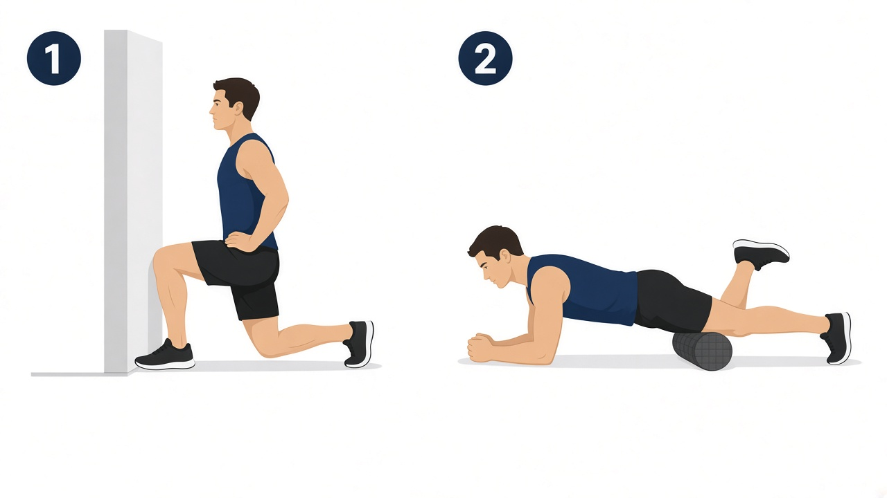
- **Зачем:** дорсифлексия голеностопа — без неё колено при спуске уходит внутрь и присед не получается глубоким.
- **ИП:** полувыпад лицом к стене, передняя стопа в 10 см от стены, пятка на полу (панель 1).
- **Движение:** колено вперёд к стене строго над 2–3 пальцем стопы, пятка не отрывается; коснулся — пауза 2 с, назад. 10/сторону. Если легко — отодвинуть стопу на 1–2 см.
- **Темп и дыхание:** ровно.
- **Ошибки:** отрыв пятки, колено внутрь, свод стопы заваливается.
- **Легче / тяжелее:** расстояние до стены; с резиной на голеностопе (тянет вперёд).

### Ролл квадрицепсов и ИТ-тракта
- **Зачем:** снижение тонуса после спусков и силовой; быстрее восстановление ощущений в квадрицепсах.
- **ИП:** лёжа лицом вниз, передняя поверхность бедра на ролле, опора на предплечья, вторая нога отведена в сторону (панель 2 выше).
- **Движение:** медленно (1 см/с) катать от паха до колена 45–60 с, на болезненных точках задержаться 5–10 с и подышать. Повернуться на бок — ИТ-тракт (наружная поверхность бедра), 30–45 с. Затем другая нога.
- **Темп и дыхание:** глубокое, медленное; боль до 6/10.
- **Ошибки:** быстрые «пилящие» движения, прокатывание колена и сустава, задержка дыхания.
- **Легче / тяжелее:** мягкий ролл → жёсткий; обе ноги на ролле → одна.

---

*Справочник создан 13.09.2026. Иллюстрации сгенерированы ИИ и служат ориентиром по позициям; при расхождении с текстом — верен текст. Дополняется при появлении новых упражнений в планах.*
